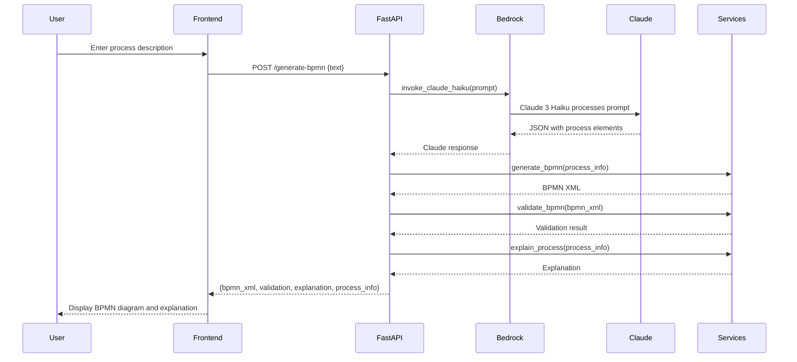

# BPMN Generator AI

A FastAPI backend that generates BPMN diagrams from business process descriptions using Amazon Bedrock (Claude 3 Haiku) or a fallback extraction. The service parses natural language, extracts process elements, and returns BPMN XML, validation, and explanation.

---

## Project Structure

```
bpmn-generator-ai/
│
├── main.py               # FastAPI application entrypoint (Bedrock/Claude logic)
├── services.py           # BPMN generation, validation, and explanation logic
├── bedrock_service.py    # Amazon Bedrock Claude 3 Haiku integration
├── models.py             # (optional) Data models
├── requirements.txt      # Python dependencies
├── Dockerfile            # Container build instructions
├── render.yaml           # Render.com deployment config
├── .env                  # Environment variables (AWS keys, etc.)
├── .dockerignore         # Docker ignore rules
├── README.md             # Project documentation
├── __init__.py           # (empty, for package structure)
├── myenv/                # Python virtual environment (local only)
├── app/
│   └── __pycache__/      # Python bytecode cache
└── test_bedrock_local.py # Script to test Bedrock integration
```

---

## Main Components

- **main.py**: FastAPI app, exposes `/generate-bpmn` endpoint. Handles CORS, request parsing, and calls Bedrock Claude 3 Haiku or fallback.
- **services.py**: Contains `generate_bpmn`, `validate_bpmn`, and `explain_process` functions. Converts structured process info to BPMN XML.
- **bedrock_service.py**: Handles AWS Bedrock client and Claude 3 Haiku invocation.
- **test_bedrock_local.py**: Standalone script to test Bedrock connectivity and Claude invocation.
- **requirements.txt**: Includes FastAPI, Uvicorn, Gunicorn, boto3, requests, bpmn-python, and other dependencies.
- **Dockerfile**: Production-ready, uses Gunicorn for serving FastAPI.
- **render.yaml**: Configuration for deploying to Render.com.
- **.env**: Stores environment variables (AWS credentials, etc.).

---

## BPMN Generation Sequence Diagram



---

## How It Works

1. **User** submits a business process description.
2. **FastAPI** receives the request and sends a prompt to Amazon Bedrock (Claude 3 Haiku).
3. **Claude** returns structured JSON with process elements (tasks, decisions, events, sequence).
4. **FastAPI** calls `generate_bpmn` in `services.py` to create BPMN XML.
5. **FastAPI** validates the BPMN XML and generates a human-readable explanation.
6. **Response** includes BPMN XML, validation status, explanation, and parsed process info.
7. If Bedrock/Claude fails, a fallback extraction is used.

---

## Deployment

- **Local**: Run with Uvicorn for development.
- **Production**: Use Docker and Gunicorn. Deploy to Render.com using `render.yaml`.

---

## Environment Variables

- `AWS_ACCESS_KEY_ID`, `AWS_SECRET_ACCESS_KEY`, `AWS_REGION`: Required for Bedrock/Claude integration.
- `LMSTUDIO_API_URL`: (legacy, not used in Bedrock flow)
- `OPENAI_API_KEY`: (legacy, not used in Bedrock flow)

---

## Extending

- Add a frontend to visualize BPMN XML (e.g., bpmn-js).
- Integrate with other LLMs or BPMN libraries.
- Add authentication or user management.

---

## License

MIT
